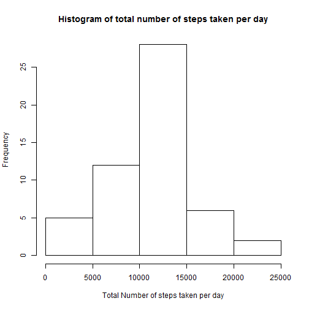
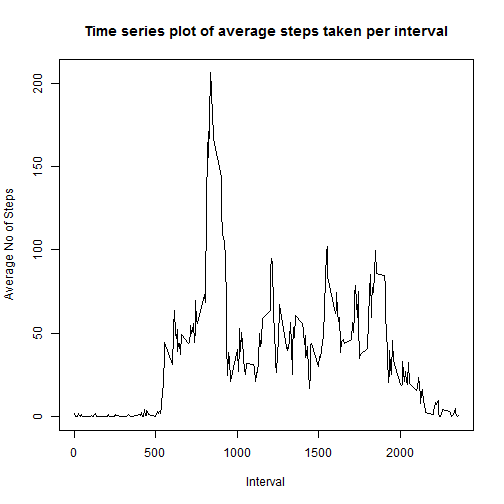
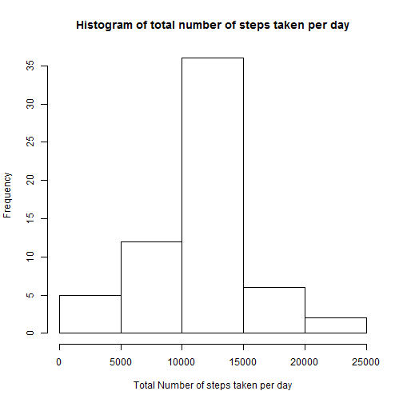
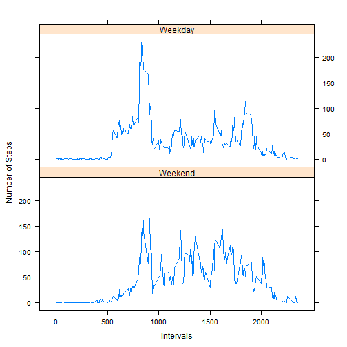

## Loading and preprocessing the data

```r
activity <- read.csv("activity/activity.csv")
activity$date <- as.Date(activity$date)
```


## What is mean total number of steps taken per day?

1. Calculate the total number of steps taken per day.

```r
totalStepsPerDay <- aggregate(steps ~ date, activity, sum, na.action = na.omit)
```

2. Make a histogram of the total number of steps taken each day.

```r
hist(totalStepsPerDay$steps, main = "Histogram of total number of steps taken per day", xlab = "Total Number of steps taken per day")
```



3. Calculate the mean and the median of the total number of steps taken each day.


```r
#The mean
mean(totalStepsPerDay$steps, na.rm = TRUE)
```

```
## [1] 10766.19
```

```r
#The median
median(totalStepsPerDay$steps, na.rm = TRUE)
```

```
## [1] 10765
```

## What is the average daily activity pattern?

1. Make a time series plot (i.e. type = "l") of the 5-minute interval (x-axis) and the average number of steps taken, averaged across all days (y-axis)


```r
averageStepsPerInterval <- aggregate(steps ~ interval, activity, mean, na.action = na.omit)

plot(averageStepsPerInterval$interval, averageStepsPerInterval$steps, type = 'l', 
     main = "Time series plot of average steps taken per interval", 
     xlab = "Interval", 
     ylab = "Average No of Steps")
```



2. Which 5-minute interval, on average across all the days in the dataset, contains the maximum number of steps?


```r
averageStepsPerInterval[which.max(averageStepsPerInterval$steps), ]$interval
```

```
## [1] 835
```

## Imputing missing values
1. Calculate and report the total number of missing values in the dataset (i.e. the total number of rows with NAs)


```r
sum(is.na(activity$steps))
```

```
## [1] 2304
```
2. Devise a strategy for filling in all of the missing values in the dataset.

I selected filling in the NA values with the average steps of that interval across all the days using the dataframe created in the previous question.

3. Create a new dataset that is equal to the original dataset but with the missing data filled in.


```r
activity[is.na(activity$steps), ]$steps <- averageStepsPerInterval[match(averageStepsPerInterval$interval, activity$interval), 2]
```

4. Make a histogram of the total number of steps taken each day and Calculate and report the mean and median total number of steps taken per day. Do these values differ from the estimates from the first part of the assignment? What is the impact of imputing missing data on the estimates of the total daily number of steps?


```r
totalStepsPerDay2 <- aggregate(steps ~ date, activity, sum)
hist(totalStepsPerDay2$steps, main = "Histogram of total number of steps taken per day", xlab = "Total Number of steps taken per day")
```



```r
#The mean
mean(totalStepsPerDay2$steps)
```

```
## [1] 10766.19
```

```r
#The median
median(totalStepsPerDay2$steps)
```

```
## [1] 10766.19
```

As the values above indicate, this does not impact the mean and remain the same as in the 1st question. However the median has increased in this step from the previous question. The mean and median are now equal.


## Are there differences in activity patterns between weekdays and weekends?
1. Create a new factor variable in the dataset with two levels - "weekday" and "weekend" indicating whether a given date is a weekday or weekend day.


```r
weekend <- c("Saturday", "Sunday")
activity$day <- factor(weekdays(activity$date) %in% weekend, levels = c(TRUE, FALSE), labels = c("Weekend", "Weekday"))
```

2. Make a panel plot containing a time series plot (i.e. type = "l") of the 5-minute interval (x-axis) and the average number of steps taken, averaged across all weekday days or weekend days (y-axis).


```r
AvgStepsOnDays <- aggregate(steps ~ interval+day, activity, mean)

library(lattice)
xyplot(steps ~ interval|day, data = AvgStepsOnDays, type = "l", layout= c(1,2), xlab = "Intervals", ylab = "Number of Steps")
```


The highest number of steps are reported between the 500th and 1000th intverals during both weekends and weekdays.Other than that, the activity patterns seem to differ between weekdays and weekends.

